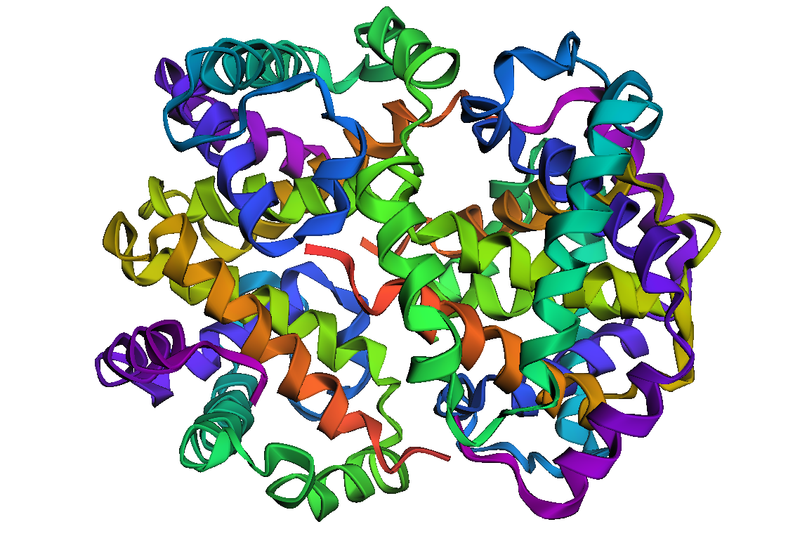

<h1 align="center">
ProtaVision: Delving into Protein Structures and Functions
</h1>

<br>

## Exploring Protein Structures and Properties: A Introduction Bioinformatics Analysis
### Collaborators: Nichelle Sequeira & Aurélie Masson
#### Practical Programming in Chemistry @ EPFL

## Table of Contents
- :pen:[Introduction](#pen-introduction)
- :paintbrush:[Features](#features)
- :fire:[Usage](#fire-usage)
- :computer:[Installation](#computer-installation)
- :hammer:[Development Installation](#hammer-development-installation)
- :scroll:[License](#scroll-license)

## :pen: Introduction

This project is part of the Practical Programming in Chemistry course given at EPFL (spring semester 2024), with aim to familiriaze ourselves with using GitHub and collaborating on a programming project together.

## :paintbrush: Features

This package enables users to input two proteins from a dictionary and determine the number of matching amino acids, along with the indices of those that do not match. In essence, it facilitates sequence alignment, a fundamental principle in bioinformatics. 
### Main Features

- **Sequence Alignment**: Efficiently compare two protein sequences to identify matching and non-matching amino acids.
- **Amino Acid Analysis**: Analyze properties of amino acids, such as molecular weight and composition.
- **Substitutions Conservatrices**: Explore amino acid substitutions that preserve biochemical properties.
- **Protein Visualization**: Visualize protein structures in 3D using PDB codes.
- **Gap Method for Sequence Alignment**: Implement a gap-based sequence alignment method.

## :fire: Usage

```python
from mypackage import main_func

# One line to rule them all
result = main_func(data)
```

This usage example shows how to quickly leverage the package's main functionality with just one line of code (or a few lines of code). 
After importing the `main_func` (to be renamed by you), you simply pass in your `data` and get the `result` (this is just an example, your package might have other inputs and outputs). 
Short and sweet, but the real power lies in the detailed documentation.

## :computer: Installation

Create a new environment, you may also give the environment a different name. 

```
conda create -n protavision python=3.10 
```

```
conda activate protavision
(conda_env) $ pip install .
```

If you need jupyter lab, install it 

```
(protavision) $ pip install jupyterlab
```
This package also uses mulptiple external package. Normally, these have already been installed. To check if you have *biopython*, *py3Dmol*, *pandas*, & *matplotlib*, run:
```
(protavision) $ conda list
```
If you don't have them, please install it by running these commands in you terminal:
```
(protavision) $ pip install biopython
(protavision) $ pip install py3Dmol
(protavision) $ pip install pandas
(protavision) $ pip install matplotlib
```

## :hammer: Development installation

Initialize Git (only for the first time). 

Note: You should have create an empty repository on `https://github.com:nichellesequeira/ProtaVision`.

```
git init
git add * 
git add .*
git commit -m "Initial commit" 
git branch -M main
git remote add origin git@github.com:nichellesequeira/ProtaVision.git 
git push -u origin main
```

Then add and commit changes as usual. 

To install the package, run

```
(protavision) $ pip install -e ".[test,doc]"
```

### Run tests and coverage

```
(conda_env) $ pip install tox
(conda_env) $ tox
```

## :scroll: License
This project is licensed under the MIT License. The MIT License is a permissive open source license that allows you to use, copy, modify, merge, publish, distribute, sublicense, and/or sell copies of the software, subject to certain conditions.

You are provided with a copy of the MIT License in the [LICENSE](LICENSE) file accompanying this repository. By using, copying, modifying, distributing, or selling this software, you agree to the terms and conditions of the MIT License.

For the full text of the MIT License, please see the [LICENSE](LICENSE) file.
